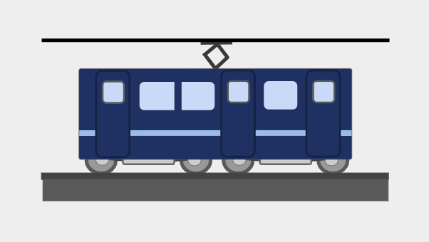

## プロイロクのプロフィール

- 主な使用言語：python・javascript
- 主な開発環境：Vscord・Google apps script
- 趣味：プログラミング・音楽鑑賞(ROCKやJ-POPなど)etc...
- 座右の銘：「信じてなければなし得ないことがきっと何処かで僕らの訪れを待っている」(Mr.Children「prelude」より)
- 好きな色：青(特に水色)・緑・黒

## proirok's profile
- Main programing language：python, javascript
- Main editor：Vscord, Google apps script
- Hobby：programing, music(ROCK & J-POP)etc...
- My motto：「Believe it, and you may be able do it someday」(from Mr.Children「prelude」)
- favorite color：blue, gleen, blcak

<!--
**proirok/proirok** is a ✨ _special_ ✨ repository because its `README.md` (this file) appears on your GitHub profile.

Here are some ideas to get you started:

- 🔭 I’m currently working on ...
- 🌱 I’m currently learning ...
- 👯 I’m looking to collaborate on ...
- 🤔 I’m looking for help with ...
- 💬 Ask me about ...
- 📫 How to reach me: ...
- 😄 Pronouns: ...
- ⚡ Fun fact: ...
-->
